# Architecture

> **Document Version:** 1.0  
> **Status:** Active  
> **Last Updated:** 30 July 2026  
> **Project:** GeoRisk AI  
> **Owner:** GeoRisk AI Team  

**Related Documents**

- `README.md`
- `PROJECT_CONSTITUTION.md`
- `docs/decisions.md`

---

# Table of Contents

1. Purpose
2. Design Goals
3. High-Level System Architecture
4. Core Principles

---

---

# Architecture Views

GeoRisk AI is described through multiple architectural views.

Each view focuses on a different aspect of the system while collectively describing the complete platform.

| View | Purpose | Sections |
|-------|---------|----------|
| System View | Overall platform structure | High-Level System Architecture |
| Layer View | Backend request processing | Backend Architecture |
| Domain View | Business capabilities | Domain Architecture |
| Spatial View | Geospatial data lifecycle | Spatial Data Architecture |
| Data View | Business data lifecycle | Data Lifecycle |
| Deployment View | Infrastructure topology | Deployment Architecture |

The following sections present each architectural view independently while maintaining a consistent overall architecture.

---

# Architectural Views

## 1. System View

The System View provides a high-level representation of GeoRisk AI and illustrates how the primary subsystems interact.

This view answers the question:

> **"What are the major parts of the system?"**

It focuses on:

- Frontend
- Backend
- Database
- Geospatial Layer
- Machine Learning Pipeline

This view intentionally omits implementation details.

---

## 2. Layer View

The Layer View describes how requests move through the backend.

This view answers:

> **"How is the backend structured?"**

Layers include:

- Router
- Service
- Repository
- Database

Each layer has a single responsibility and communicates only with adjacent layers.

---

## 3. Domain View

The Domain View describes the business capabilities of GeoRisk AI.

Unlike the Layer View, this perspective focuses on **what the application does** rather than **how it is implemented**.

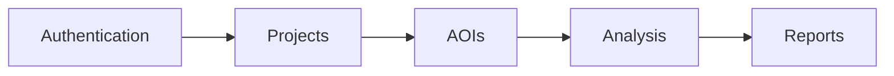

Each domain represents an independent business capability.

Future domains should integrate into this architecture without affecting existing domains.

Examples include:

- Notifications
- Collaboration
- Administration
- Model Management

---

## 4. Spatial View

The Spatial View documents the lifecycle of geographic information.

This view answers:

> **"How does spatial data move through the system?"**

It includes:

- GeoJSON
- Validation
- Conversion
- PostGIS
- Spatial Queries

This view is unique to GIS applications and forms the foundation of GeoRisk AI.

---

## 5. Data View

The Data View illustrates how information evolves from user input into analytical outputs.

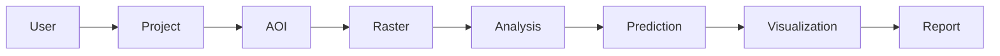

This perspective emphasizes business workflows rather than software implementation.

---

## 6. Deployment View

The Deployment View describes the physical deployment of GeoRisk AI.

It illustrates how software components are distributed across infrastructure.

This includes:

- Frontend
- Backend
- PostgreSQL/PostGIS
- Object Storage
- ML Services

This view becomes increasingly important as the platform scales beyond local development.

---

# 1. Purpose

This document describes the overall software architecture of **GeoRisk AI**.

Its purpose is to provide contributors with a complete understanding of how the system is structured, how its components interact, and the architectural principles that guide development.

Unlike implementation documentation, this document focuses on **system design**, **component responsibilities**, and **long-term maintainability** rather than individual code details.

This document serves as the primary architectural reference for:

- Developers
- Reviewers
- Future contributors
- AI-assisted development tools
- Technical documentation

Implementation details should remain within the codebase or module-specific documentation.

---

# 2. Design Goals

GeoRisk AI is designed around several long-term engineering goals.

## 2.1 Maintainability

The system should remain understandable and easy to modify as new features are introduced.

Every module should have a clearly defined responsibility with minimal coupling to other parts of the application.

---

## 2.2 Scalability

The architecture should support future expansion without requiring significant refactoring.

Examples include:

- Multiple analysis models
- Background processing
- Additional geospatial datasets
- Cloud deployment
- Team collaboration
- Public APIs

---

## 2.3 Separation of Concerns

Each layer of the application owns a single responsibility.

Business logic, persistence, API handling, validation, and geospatial processing are intentionally separated into independent modules.

This minimizes duplication and improves long-term maintainability.

---

## 2.4 Modularity

Every major feature should be developed as an independent module.

Examples include:

- Authentication
- Projects
- Areas of Interest (AOIs)
- Raster Processing
- Machine Learning
- Analysis Jobs

New modules should integrate into the existing architecture without modifying unrelated components.

---

## 2.5 Type Safety

GeoRisk AI prioritizes explicit typing throughout the application.

Examples include:

- Typed request models
- Typed response models
- SQLAlchemy ORM models
- Repository interfaces
- Service methods

Strong typing improves reliability, readability, and tooling support.

---

## 2.6 Documentation-Driven Development

Architectural decisions should be documented before implementation whenever possible.

The project follows the philosophy that documentation is part of the software rather than an afterthought.

Major design decisions are recorded as Architecture Decision Records (ADRs).

---

## 2.7 GIS-First Architecture

Geospatial data is a first-class concern within GeoRisk AI.

The architecture is designed around modern GIS standards rather than treating spatial data as generic JSON.

This includes:

- GeoJSON for external APIs
- PostGIS for spatial storage
- Dedicated geometry conversion
- Dedicated validation
- Future raster processing

---

# 3. High-Level System Architecture

GeoRisk AI follows a layered architecture designed to isolate responsibilities while maintaining clear communication between components.

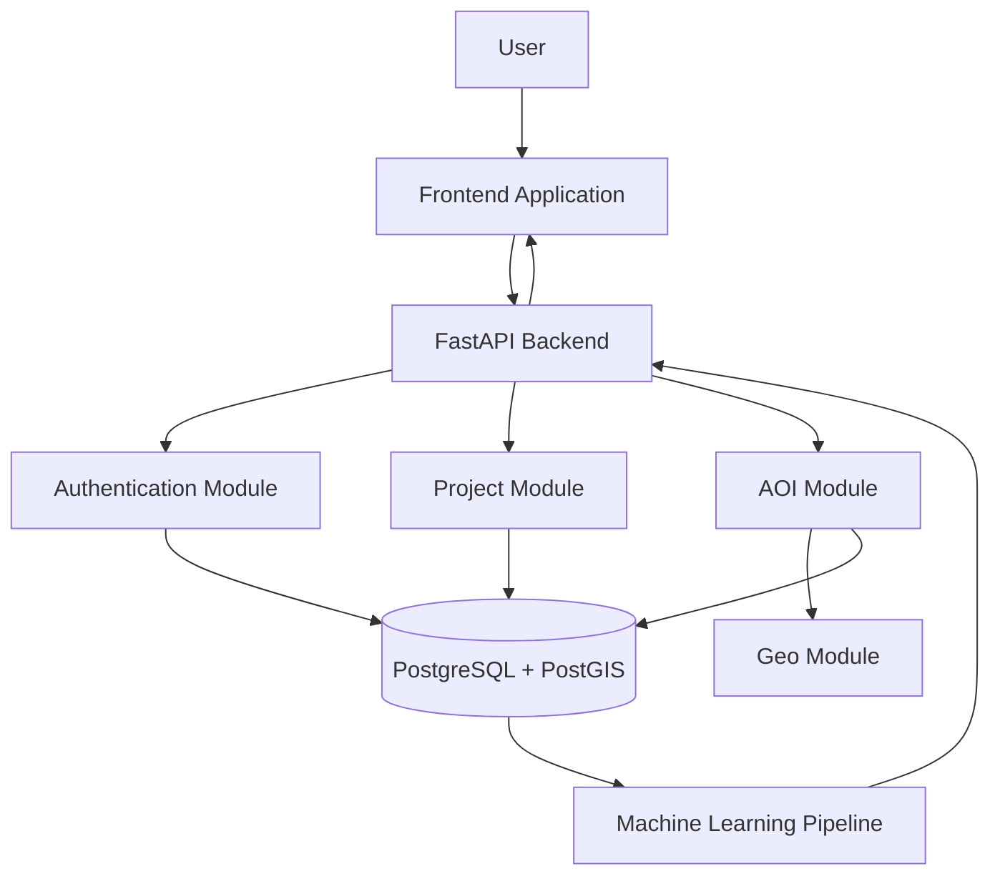

The backend acts as the central orchestration layer between the client application, geospatial database, and future machine learning components.

Each subsystem has clearly defined responsibilities and communicates through well-defined interfaces.

---

## System Components

### Frontend

The frontend provides the user interface for interacting with projects, maps, and analysis results.

Primary responsibilities include:

- User authentication
- Project management
- Interactive mapping
- AOI creation
- Visualization of analysis results

The frontend communicates exclusively through the REST API.

---

### Backend API

The backend exposes all application functionality through REST endpoints.

Responsibilities include:

- Authentication
- Authorization
- Business logic
- Validation
- Geospatial processing
- Database coordination

No client communicates directly with the database.

---

### Geospatial Layer

The geospatial layer provides reusable functionality for working with spatial data.

Responsibilities include:

- GeoJSON schemas
- Geometry validation
- Geometry conversion
- Future spatial operations

This layer isolates GIS-specific logic from the rest of the application.

---

### Database

PostgreSQL with PostGIS serves as the system of record.

Responsibilities include:

- Persistent storage
- Spatial indexing
- Spatial queries
- Relational integrity

Spatial data is stored using native PostGIS geometry types.

---

### Machine Learning Pipeline (Planned)

Future analysis modules will consume geospatial datasets and produce risk predictions.

Planned responsibilities include:

- Raster preprocessing
- Model inference
- Uncertainty estimation
- Result generation
- Spatial overlays

The machine learning subsystem is intentionally separated from the REST API to allow independent scaling.

---

# System Context

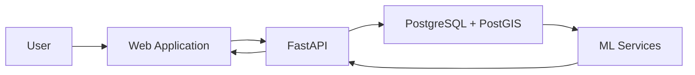

The client never communicates directly with the database or machine learning components.

All communication flows through the backend API.

This centralization simplifies authentication, validation, logging, and future scalability.

---

# 4. Core Principles

The architecture is guided by several fundamental principles.

These principles should remain consistent as the project evolves.

---

## Layered Architecture

Each layer owns a single responsibility.

Layers communicate only with adjacent layers.

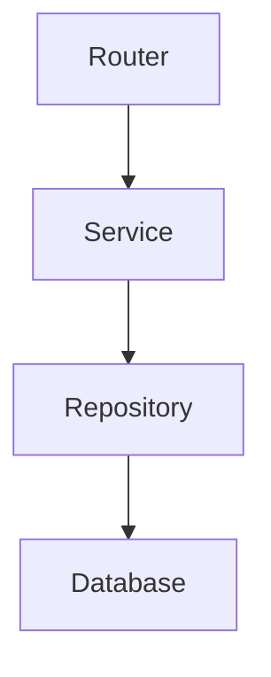

This minimizes coupling and improves maintainability.

---

## Single Responsibility Principle

Every module should solve one problem well.

Examples include:

| Module | Responsibility |
|---------|----------------|
| Authentication | User identity and access |
| Projects | Project management |
| AOIs | Spatial project regions |
| Geo | GIS-specific utilities |
| Repositories | Database persistence |
| Services | Business rules |

Responsibilities should never overlap unnecessarily.

---

## Explicit Data Flow

Data should move through the system in a predictable manner.

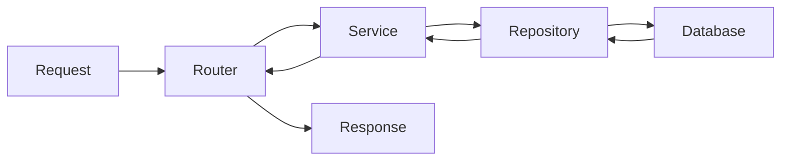

Every transformation occurs in a known location.

This improves debugging and testing.

---

## Dependency Injection

Application components should receive their dependencies rather than creating them internally.

This reduces coupling and improves testability.

FastAPI's dependency injection system is used throughout the backend.

---

## Documentation as Architecture

Documentation is considered part of the system.

Major architectural decisions should be recorded before implementation.

Related documents include:

- `PROJECT_CONSTITUTION.md`
- `docs/decisions.md`
- Backend module documentation
- Frontend module documentation

Documentation should evolve alongside the codebase.

---

## Long-Term Evolution

GeoRisk AI is expected to evolve beyond its initial feature set.

The architecture has been designed to accommodate future capabilities without requiring major structural changes.

Planned areas of expansion include:

- Raster processing
- Multiple ML models
- Background workers
- Distributed processing
- Cloud deployment
- Team collaboration
- Advanced GIS analytics

The guiding principle is to extend the existing architecture rather than replacing it.

---

# 5. Backend Architecture

## Overview

The backend is implemented using **FastAPI** and follows a layered architecture that separates HTTP handling, business logic, data persistence, and infrastructure concerns.

Each layer has a clearly defined responsibility and communicates only with adjacent layers. This separation improves maintainability, testability, and long-term scalability.

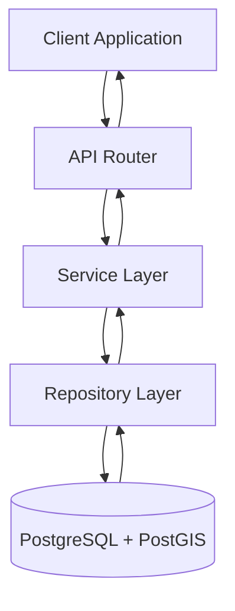

The backend follows a strict request lifecycle to ensure that validation, authorization, business logic, and persistence remain isolated from one another.

---

# Backend Layers

## API Layer

Location:

```
app/api/
```

The API layer is responsible for exposing REST endpoints to clients.

Responsibilities include:

- Route definitions
- Request parsing
- Response serialization
- Dependency injection
- HTTP status codes
- Authentication dependencies

The API layer **must not** contain business logic.

Instead, every endpoint delegates work to the appropriate service.

Example responsibilities:

- `POST /projects`
- `GET /aois`
- `DELETE /projects/{id}`

The router should remain thin and predictable.

---

## Service Layer

Location:

```
app/services/
```

The service layer contains all business logic.

It coordinates:

- repositories
- validation
- authorization
- geospatial processing
- external services
- future ML inference

The service layer represents the core of the application.

Example:

```text
Create Project

↓

Validate request

↓

Verify ownership

↓

Persist project

↓

Return DTO
```

Services should not know anything about HTTP.

They should operate using Python objects and domain models.

---

## Repository Layer

Location:

```
app/repositories/
```

Repositories provide access to persistent storage.

Responsibilities include:

- CRUD operations
- SQLAlchemy queries
- spatial queries
- transactions
- pagination

Repositories should **never** contain business rules.

Incorrect:

```text
if project.owner != user:
    ...
```

Correct:

```text
SELECT ...

INSERT ...

UPDATE ...

DELETE ...
```

Repositories only answer one question:

> "How do I retrieve or persist data?"

---

## Database Layer

Location:

```
PostgreSQL + PostGIS
```

The database stores the persistent state of the application.

Responsibilities include:

- relational integrity
- foreign keys
- spatial indexing
- geometry storage
- query optimization

Business decisions should never be implemented as SQL constraints when they belong in the service layer.

---

# Backend Directory Structure

```text
app/

├── api/
├── services/
├── repositories/
├── models/
├── schemas/
├── geo/
├── db/
├── dependencies/
├── exceptions/
├── core/
└── utils/
```

Each directory represents a distinct architectural concern.

No directory should depend on implementation details from unrelated modules.

---

# Dependency Injection

GeoRisk AI uses FastAPI's dependency injection system to construct request-scoped dependencies.

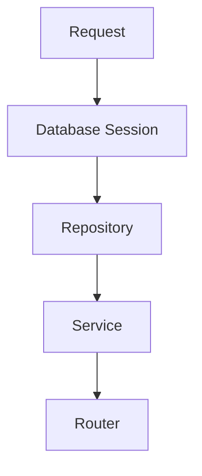

Dependencies are created once per request and injected automatically.

Typical dependency chain:

```
Database Session

↓

Repository

↓

Service

↓

Router
```

This approach improves:

- testability
- loose coupling
- modularity
- code reuse

---

## Dependency Rules

Dependencies should only move downward.

```
Router

↓

Service

↓

Repository

↓

Database
```

Reverse dependencies are prohibited.

Repositories should never import services.

Services should never import routers.

---

# Request Lifecycle

Every HTTP request follows the same processing pipeline.

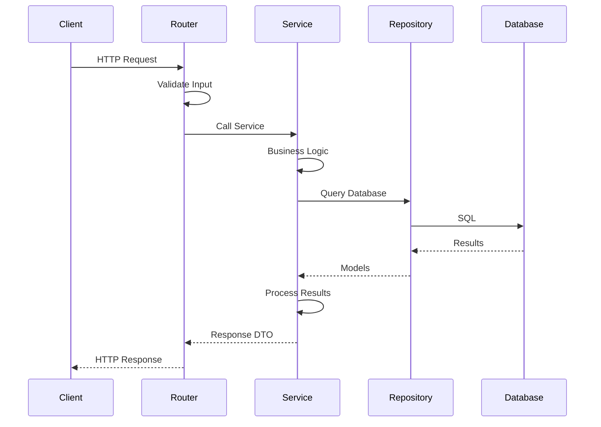

This predictable lifecycle makes debugging and testing significantly easier.

---

# Validation Pipeline

Validation occurs in multiple stages.

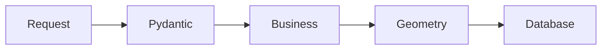

## Stage 1

Pydantic validates:

- required fields
- types
- formats
- constraints

---

## Stage 2

The service validates:

- ownership
- permissions
- business rules
- relationships

---

## Stage 3

The geo module validates:

- GeoJSON
- geometry validity
- topology
- coordinate structure

---

## Stage 4

The database enforces:

- foreign keys
- unique constraints
- indexes
- transactions

---

# Exception Flow

Exceptions move upward through the application.

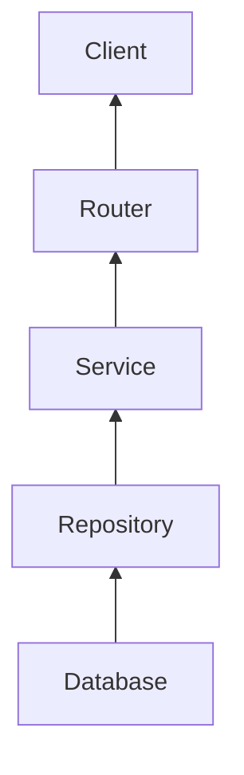

Infrastructure exceptions should be translated into application-specific exceptions whenever possible.

For example:

```
SQLAlchemyError

↓

Repository

↓

ProjectNotFoundError

↓

Router

↓

404 Not Found
```

This keeps HTTP concerns separate from persistence concerns.

---

# Module Responsibilities

Each module owns a clearly defined domain.

| Module | Responsibility |
|----------|----------------|
| Authentication | User identity and access control |
| Projects | Project lifecycle management |
| AOIs | Areas of Interest |
| Geo | GIS utilities and validation |
| Repositories | Database persistence |
| Services | Business logic |
| API | HTTP interface |
| Database | Persistent storage |

Modules should communicate only through public interfaces.

---

# Cross-Module Communication

Modules interact through services rather than directly accessing one another's internals.

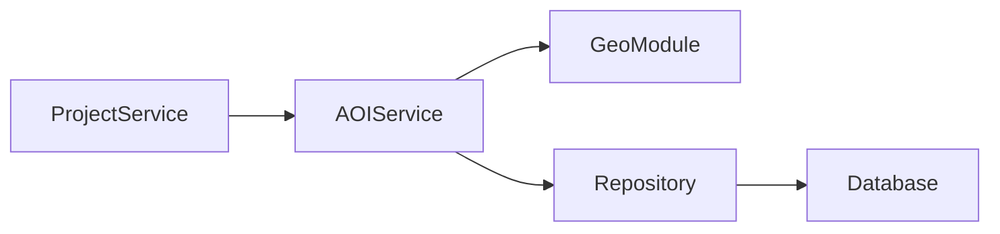

This architecture prevents tight coupling and encourages reusable components.

---

# Architectural Constraints

To preserve consistency across the backend, the following constraints apply:

- Routers must not contain business logic.
- Services must not perform raw SQL.
- Repositories must not implement authorization.
- Models must not contain business logic.
- Schemas must not access the database.
- Utility modules must remain stateless.
- Dependencies should be injected rather than instantiated directly.
- Geospatial operations must be implemented within the `geo` package.
- All exceptions should derive from `AppException`.
- Public APIs should expose GeoJSON rather than internal geometry types.

These constraints ensure that the architecture remains modular, predictable, and maintainable as the project evolves.

---

# 6. Spatial Data Architecture

## Overview

Spatial data is a first-class component of GeoRisk AI. Unlike conventional web applications that treat geographic information as generic JSON, GeoRisk AI is designed around modern Geographic Information System (GIS) principles.

The architecture separates the external representation of spatial data from its internal storage format.

Clients interact exclusively using **GeoJSON**, while the backend stores geometries using **PostGIS** native geometry types. A dedicated geospatial layer is responsible for validation, conversion, and future spatial operations.

This separation ensures that API consumers remain independent of database implementation details while allowing the backend to leverage the full capabilities of PostGIS.

---

# Spatial Data Flow

Every geometry follows the same lifecycle from creation to retrieval.

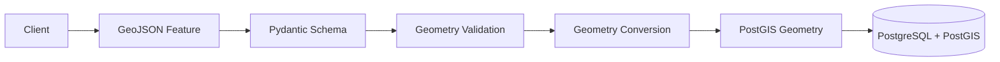

The reverse process occurs when data is returned to the client.

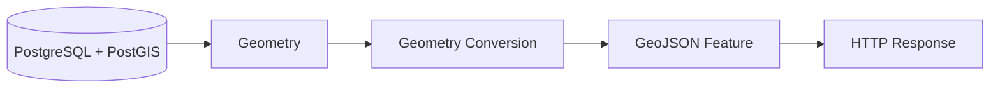

---

# Public vs Internal Data Representation

GeoRisk AI intentionally separates external API models from internal database models.

| External Representation | Internal Representation |
|-------------------------|-------------------------|
| GeoJSON Feature | PostGIS Geometry |
| JSON | Binary Geometry |
| RFC 7946 | EWKB / Geometry |
| Client-facing | Database-facing |

This abstraction prevents database implementation details from leaking into the public API while allowing the backend to optimize spatial storage and queries.

---

# Geo Package

Location:

```text
app/geo/
```

The `geo` package centralizes all GIS-specific functionality.

Responsibilities include:

- Geometry validation
- GeoJSON conversion
- Spatial constants
- Coordinate utilities
- Future spatial analysis
- Raster utilities

The rest of the application should never manipulate geometry directly.

Instead, all spatial operations pass through this package.

---

# Geometry Validation Pipeline

Spatial validation occurs in several stages before a geometry is persisted.

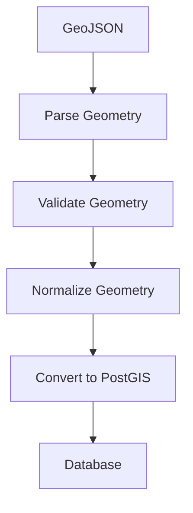

Each stage performs a specific responsibility.

---

## Parsing

Incoming GeoJSON is parsed into Shapely geometry objects.

Malformed GeoJSON results in an `InvalidGeoJSONError`.

---

## Validation

The geometry is validated to ensure it is structurally correct.

Examples include:

- Valid polygons
- Closed rings
- Supported geometry types
- Non-empty geometries

Invalid geometries result in an `InvalidGeometryError`.

---

## Normalization

Future versions may normalize geometries before storage.

Possible operations include:

- Coordinate precision reduction
- Polygon orientation
- MultiPolygon normalization
- Geometry repair where appropriate

---

## Conversion

Validated geometries are converted into GeoAlchemy2 objects for persistence.

Conversion logic is isolated from business logic.

---

# Supported Geometry Types

The current implementation focuses on Areas of Interest (AOIs).

Supported geometry types include:

| Geometry | Status |
|-----------|--------|
| Polygon | ✅ |
| MultiPolygon | Planned |
| LineString | Planned |
| MultiLineString | Planned |
| Point | Planned |
| MultiPoint | Planned |

Future geometry types should integrate into the existing validation pipeline without requiring architectural changes.

---

# Coordinate Reference System

GeoRisk AI standardizes on the WGS84 coordinate reference system.

```text
SRID: 4326
```

The application exposes this value through a shared constant.

```python
DEFAULT_SRID = 4326
```

Using a shared constant avoids magic numbers and simplifies future migrations.

---

# Spatial Operations

Spatial operations are intentionally isolated from repositories and services.

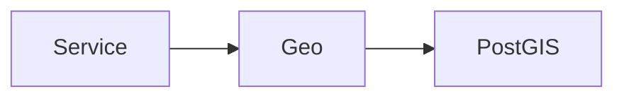

Examples of future operations include:

- Intersection
- Containment
- Buffer generation
- Distance calculations
- Bounding boxes
- Area calculations
- Coordinate transformations

This keeps GIS-specific algorithms within a dedicated module.

---

# Raster Processing Architecture (Planned)

Future versions of GeoRisk AI will support raster datasets alongside vector geometries.

```mermaid
flowchart TD

Upload

Validation

Raster Storage

Preprocessing

ML Pipeline

Analysis

Visualization

Upload --> Validation
Validation --> Raster Storage
Raster Storage --> Preprocessing
Preprocessing --> ML Pipeline
ML Pipeline --> Analysis
Analysis --> Visualization
```

Raster processing will remain independent from vector processing while sharing common spatial metadata.

---

# 7. Database Architecture

## Overview

GeoRisk AI uses PostgreSQL with the PostGIS extension as its primary datastore.

PostgreSQL provides transactional consistency and relational integrity, while PostGIS adds advanced spatial capabilities such as geometry types, spatial indexing, and GIS functions.

The database is treated as the system of record for all persistent application data.

---

# High-Level Data Model

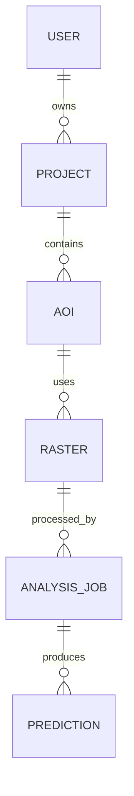

This model reflects the logical relationships between major business domains.

Additional entities may be introduced without changing the overall structure.

---

# Database Layers

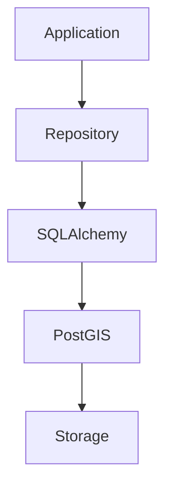

Each layer abstracts the complexity of the layer below it.

---

# Entity Responsibilities

## User

Represents an authenticated application user.

Responsibilities:

- Identity
- Authentication
- Project ownership

---

## Project

Represents a logical workspace.

Responsibilities:

- Organizing AOIs
- Managing analyses
- User ownership

---

## AOI

Represents an Area of Interest.

Responsibilities:

- Geometry storage
- Spatial metadata
- Future analysis input

---

## Raster

Represents uploaded raster datasets.

Responsibilities:

- Satellite imagery
- DEMs
- Derived raster products

---

## Analysis Job

Represents asynchronous processing tasks.

Responsibilities:

- ML inference
- Background execution
- Progress tracking

---

## Prediction

Represents generated analysis outputs.

Responsibilities:

- Risk maps
- Confidence metrics
- Future uncertainty products

---

# Spatial Indexing

Spatial queries rely on PostGIS indexing for performance.

```mermaid
flowchart LR

Geometry

GiST Index

Spatial Query

Results

Geometry --> GiST Index
GiST Index --> Spatial Query
Spatial Query --> Results
```

Spatial indexes enable efficient operations such as:

- Spatial intersection
- Containment
- Proximity searches
- Bounding box filtering

---

# Transaction Management

Repositories are responsible for database interaction, while transaction boundaries are managed at the application level.

```mermaid
sequenceDiagram

Client->>Service: Request

Service->>Repository: Persist Entity

Repository->>Database: INSERT

Database-->>Repository: Success

Repository-->>Service: Entity

Service-->>Client: Response
```

If an operation fails, the transaction is rolled back to preserve consistency.

---

# Future Database Evolution

The current schema is intentionally designed to support future expansion.

Planned additions include:

- Versioned analyses
- Raster metadata
- ML model registry
- Team collaboration
- Audit logging
- Background task history
- Notification system

These additions should integrate into the existing relational model without requiring significant restructuring.

---

# 8. Frontend Architecture (Planned)

## Overview

The frontend serves as the primary interface between users and the GeoRisk AI platform.

It is responsible for presenting geospatial information, managing user interactions, and communicating with the backend through a well-defined REST API.

The frontend is intentionally separated from business logic. All validation, authorization, and persistence remain the responsibility of the backend.

---

# High-Level Frontend Architecture

```mermaid
flowchart TD

Browser["Web Browser"]

Pages["Pages"]

Features["Feature Modules"]

Components["Shared Components"]

API["API Client"]

Backend["FastAPI Backend"]

Browser --> Pages
Pages --> Features
Features --> Components
Features --> API
API --> Backend
```

Each layer has a clearly defined responsibility.

---

# Planned Frontend Structure

```text
frontend/

src/

├── app/
├── pages/
├── features/
├── components/
├── hooks/
├── services/
├── types/
├── assets/
└── utils/
```

This structure promotes modularity while allowing new features to integrate without affecting unrelated components.

---

# Frontend Responsibilities

The frontend is responsible for:

- Authentication flows
- Project management
- Interactive maps
- AOI creation and editing
- Raster visualization
- Displaying analysis results
- User experience
- Client-side state management

The frontend should never implement business rules that belong on the backend.

---

# API Communication

The frontend communicates exclusively with the backend through REST endpoints.

```mermaid
sequenceDiagram

participant User
participant Frontend
participant Backend
participant Database

User->>Frontend: Interaction

Frontend->>Backend: HTTP Request

Backend->>Database: Query

Database-->>Backend: Result

Backend-->>Frontend: JSON Response

Frontend-->>User: Render UI
```

All communication is stateless and authenticated where required.

---

# State Management

The frontend maintains two categories of state.

## Server State

Managed through API communication.

Examples include:

- Projects
- AOIs
- Analysis results
- User profile

---

## Client State

Managed locally.

Examples include:

- Map controls
- Theme
- Modal visibility
- Drawing mode
- Selected features

Separating server and client state reduces unnecessary complexity.

---

# 9. Machine Learning Architecture (Planned)

## Overview

Machine learning forms the analytical core of GeoRisk AI.

The ML subsystem consumes spatial datasets and generates predictive outputs that assist users in assessing environmental risk.

The ML pipeline is intentionally isolated from the REST API to allow independent development, deployment, and scaling.

---

# ML Pipeline

```mermaid
flowchart TD

Upload["Raster Upload"]

Validation

Preprocessing

Inference

PostProcessing["Post Processing"]

Prediction

Visualization

Upload --> Validation
Validation --> Preprocessing
Preprocessing --> Inference
Inference --> PostProcessing
PostProcessing --> Prediction
Prediction --> Visualization
```

Each stage performs a single responsibility.

---

# ML Responsibilities

The ML subsystem is responsible for:

- Raster preprocessing
- Feature extraction
- Model inference
- Confidence estimation
- Uncertainty quantification
- Prediction generation
- Future model management

The backend coordinates the pipeline but does not implement model logic directly.

---

# Planned Model Lifecycle

```mermaid
flowchart LR

Dataset

Training

Validation

Deployment

Inference

Monitoring

Dataset --> Training
Training --> Validation
Validation --> Deployment
Deployment --> Inference
Inference --> Monitoring
```

Future versions may support multiple production models.

---

# 10. Security Architecture

## Overview

Security is implemented as a cross-cutting concern rather than an isolated module.

Every layer contributes to protecting application integrity.

---

# Authentication Flow

```mermaid
sequenceDiagram

participant User
participant Frontend
participant Backend
participant Database

User->>Frontend: Login

Frontend->>Backend: Credentials

Backend->>Database: Verify User

Database-->>Backend: User

Backend-->>Frontend: JWT

Frontend-->>User: Authenticated
```

---

# Authorization

Authorization is performed in the service layer.

Examples include:

- Project ownership
- AOI ownership
- Resource access
- Administrative operations

Repositories never implement authorization rules.

---

# Validation Layers

```mermaid
flowchart LR

Input

Pydantic

Business

Geometry

Database

Input --> Pydantic
Pydantic --> Business
Business --> Geometry
Geometry --> Database
```

Validation occurs before data reaches persistent storage.

---

# Security Principles

GeoRisk AI follows several security principles:

- Least privilege
- Input validation
- Secure password storage
- Authenticated API access
- Explicit authorization
- Exception sanitization
- Secure dependency management

Future versions may introduce:

- Role-Based Access Control (RBAC)
- Multi-factor authentication
- Audit logging
- API rate limiting

---

# 11. Deployment Architecture (Planned)

GeoRisk AI is designed to support both local development and production deployments.

```mermaid
flowchart TD

Users

Frontend

Backend

PostgreSQL

ObjectStorage["Object Storage"]

ML

Users --> Frontend
Frontend --> Backend
Backend --> PostgreSQL
Backend --> ObjectStorage
Backend --> ML
```

The architecture separates compute, storage, and application responsibilities to support future scaling.

---

# Planned Infrastructure

Future production deployments may include:

- Docker
- Reverse proxy
- HTTPS
- Cloud object storage
- Background workers
- Monitoring
- Automated backups
- CI/CD pipelines

These components can be introduced without changing the application's architectural layers.

---

# 12. Data Lifecycle

GeoRisk AI is fundamentally a data-driven platform.

The following diagram illustrates how information progresses through the system.

```mermaid
flowchart LR

User

Project

AOI

Raster

Analysis

Prediction

Visualization

Report

User --> Project
Project --> AOI
AOI --> Raster
Raster --> Analysis
Analysis --> Prediction
Prediction --> Visualization
Visualization --> Report
```

Each stage enriches the data while preserving traceability back to the originating project.

---

# Data Evolution

Data progresses through several phases.

1. Collection
2. Validation
3. Storage
4. Analysis
5. Prediction
6. Visualization
7. Reporting

This lifecycle provides a consistent framework for future platform capabilities.

---

# 13. Future Evolution

GeoRisk AI is designed to evolve incrementally.

Future architectural additions include:

- Multiple machine learning models
- Distributed inference
- Team collaboration
- Versioned analyses
- Real-time monitoring
- Cloud-native deployment
- Plugin architecture
- External APIs
- Automated reporting

These capabilities should extend the existing architecture rather than replace it.

---

# 14. Architectural Summary

GeoRisk AI follows a layered, modular architecture designed around modern software engineering and GIS principles.

Key architectural characteristics include:

- Layered backend architecture
- Domain-oriented modules
- Dedicated geospatial layer
- Strict separation of concerns
- GeoJSON-first APIs
- Native PostGIS storage
- Independent machine learning pipeline
- Modular frontend architecture
- Documentation-driven development

Every component has a clearly defined responsibility, and communication occurs only through well-defined interfaces.

The architecture prioritizes maintainability, scalability, and clarity over unnecessary complexity.

As the platform grows, new features should integrate into the existing architecture while preserving these guiding principles.

---

# Architecture Principles Checklist

Every new feature should satisfy the following principles before implementation.

| Principle | Status |
|-----------|:------:|
| Single Responsibility | ☐ |
| Layered Architecture | ☐ |
| Domain Isolation | ☐ |
| Dependency Injection | ☐ |
| Documentation Updated | ☐ |
| Tests Added | ☐ |
| ADR Required? | ☐ |
| API Consistency | ☐ |
| Geospatial Standards | ☐ |
| Security Considered | ☐ |

This checklist should be reviewed whenever a significant architectural change is introduced.